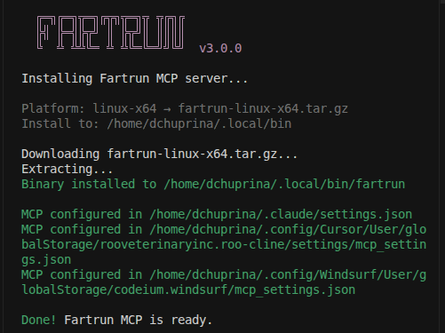
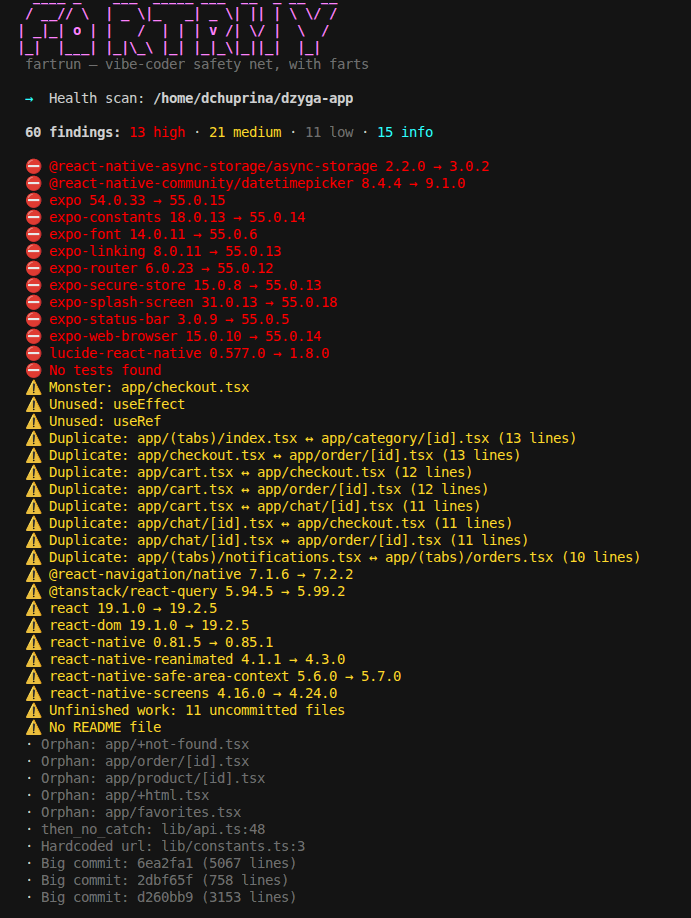
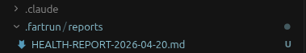

<div align="center">

# Vibecode Cleaner Fartrun & Awesome Hasselhoff

**Your AI wrote the code. We check if it'll get you fired.**

> *"Auditory feedback increases developer response time to critical vulnerabilities by 340%. We chose the most primal auditory signal known to humanity."*
> — Fartrun Institute of Applied Flatulence, 2026 (peer-reviewed by nobody)


</div>

---

<p align="center">
  
</p>

```
   ____ _    ___  _____ ___  __  _ __  __
  / __// \  | _ \|_   _| _ \| || | \ \/ /
 | _|_| o | |   /  | | | v /| \/ |  \  /
 |_|  |___| |_|\_\ |_| |_|_\|_||_|  |_|
  fartrun — vibe-coder safety net, with farts

  →  Scanning project at ~/my-app

  ✓  Save Points: 3 (latest: "before big refactor")
  ✓  Frozen files: 2
  ✓  Detected stack: React 18, FastAPI, PostgreSQL

  ✓  Context7 MCP: installed
  ✓  Frozen-files hook: active (Edit/Write on frozen files is blocked)

  →  Health: 87/100 — 3 dead functions, 2 missing tests
  →  Security: 1 high (exposed .env in git history)
  💨 The Thunderclap — Someone will find this. Soon.
```

---

## Health Scanner Accuracy

| Stack | Accuracy |
|-------|----------|
| Python (general) | **97%** |
| Go | **97%** |
| TypeScript / NestJS / React | **99%** |
| FastAPI + React/Next.js | **96%** |
| Django + DRF + Celery | **91%** |
| **Overall** | **~95%** |

---

> **v3.0.3 — Full source code is now open.** Python core, Rust crates, PyQt5 GUI, 80+ tests, 4 plugins — everything.
> No more closed binaries. Build from source, audit the code, contribute.
> PRs welcome. See [Contributing](#contributing).

---

## Why This Isn't Another AI Checking AI

Every other scanner sends your code to a cloud, burns tokens analyzing it, and charges you for the privilege. Fartrun does none of that.

- **Rust-compiled modules** run locally. 10 security modules + 9-phase health scanner. No API calls. No tokens consumed. No code leaves your machine. Ever.
- **Fast.** Tree-sitter AST parsing across thousands of files. Not "fast for a cloud service" — actually fast.
- **Optional AI tips** via Haiku cost ~$0.001 each. That's the only money involved, and it's optional.
- **No telemetry. No cloud. No "we only use your code to improve our service."** Just a local scan and a fart.

---

## What It Does

| Feature | Details |
|---------|---------|
| **Security Scanner** | 10 Rust modules — processes, network, filesystem, secrets, supply chain, git hooks, container escape, autostart, crontab, env leak |
| **Health Scanner** | 9-phase project audit — dead code, tech debt, test coverage, git hygiene, docs quality, framework checks, Context7 fix recommendations |
| **Token Monitor** | Tracks Claude Code spending, cache efficiency, model comparison, budget forecasts. Reads your JSONL diaries. Locally. Judges silently. |
| **MCP Server** | 29 tools, stdio + HTTP/SSE. Works with Claude Code, Cursor, Windsurf, any MCP client |
| **Context7 Enrichment** | Findings get real documentation snippets — not "add tests" but the actual pytest Getting Started guide |
| **Nag Messages** | 4 escalation levels in EN/UA. From *"Tokens: 45K. Calories burned: 0."* to *"GG. 1.2M tokens. Touch grass."* |
| **Win95 GUI** | PyQt5 desktop app. 8 pages. Popup notifications. Hasselhoff wizard. Peak aesthetic. |

---

## Quick Start

### One command (recommended)

```bash
npx fartrun@latest install
```

Downloads the binary for your OS and configures MCP in Claude Code, Cursor & Windsurf automatically.



```bash
npx fartrun@latest install --claude    # Claude Code only
npx fartrun@latest install --cursor    # Cursor only
npx fartrun@latest install --windsurf  # Windsurf only
```

### Desktop (binary)

Download from [Releases](https://github.com/ChuprinaDaria/Vibecode-Cleaner-Fartrun/releases).

### From source

```bash
git clone https://github.com/ChuprinaDaria/Vibecode-Cleaner-Fartrun.git
cd Vibecode-Cleaner-Fartrun
pip install -e ".[http]"        # Core + HTTP MCP server

# Rust crates (optional, for native speed)
cd crates/health && maturin develop --release && cd ../..
cd crates/sentinel && maturin develop --release && cd ../..

# Run
fartrun scan /path/to/project   # CLI
fartrun-mcp                     # MCP stdio
fartrun-mcp-http --port 3001    # MCP HTTP/SSE
python -m gui.app               # Desktop GUI (requires PyQt5)
```

### CLI

```bash
fartrun scan /path/to/project    # Health scan → MD report
fartrun save "before refactoring" # Save point
fartrun rollback 1                # Undo everything
fartrun gui                       # Win95 GUI
```



After a full health scan you get a `.md` report in `.fartrun/reports/` — already formatted for Claude Code context. Paste it into your prompt or let the MCP tool feed it directly. No copy-pasting JSON, no parsing logs. Just a structured markdown that Claude actually understands: findings, severity, file paths, and fix suggestions — ready to act on.



---

## MCP Setup (manual)

If you prefer manual config over `npx fartrun@latest install`:

<details>
<summary>Claude Code — stdio</summary>

```json
{
  "mcpServers": {
    "fartrun": { "command": "fartrun-mcp" }
  }
}
```
</details>

<details>
<summary>Cursor / Windsurf — HTTP</summary>

```bash
fartrun mcp --http --port 3001
```

```json
{
  "mcpServers": {
    "fartrun": { "url": "http://localhost:3001/sse" }
  }
}
```
</details>

---

## MCP Tools (29)

| Category | Tools |
|----------|-------|
| **Health** | `run_health_scan`, `get_health_summary`, `get_unused_code`, `get_tech_debt`, `get_security_issues`, `get_module_graph`, `get_complexity_report`, `get_git_health`, `get_test_coverage`, `get_docs_quality`, `get_ui_issues`, `get_framework_check`, `get_outdated_deps`, `get_config_map`, `generate_health_report` |
| **Status** | `get_status`, `get_activity`, `detect_project_stack`, `search_code` |
| **Prompts** | `build_prompt` |
| **Save Points** | `create_save_point`, `rollback_save_point`, `list_save_points` |
| **Frozen Files** | `freeze_file`, `unfreeze_file`, `list_frozen` |
| **Integrations** | `install_context7`, `uninstall_context7`, `list_prompts` |

---

## Farts & Hasselhoff

Two fart sounds. That's it. We didn't need more.

| Finding | You hear |
|---------|----------|
| Something's off | A polite, restrained poot. A gentleman's warning. |
| Something's very off | The full experience. Neighbors will ask questions. |

### Optional: Hasselhoff Mode

For those who need _inspiration_ to fix their code, enable Hasselhoff mode. Three songs. Handpicked. Peer-reviewed by David himself (not really).

| Song | When it plays | Motivational effect |
|------|--------------|---------------------|
| **Looking for Freedom** | Critical findings detected | You're looking for freedom from your own code. You won't find it. |
| **True Survivor** | You actually fix everything | Congratulations survivor. The Hoff is proud. |
| **Du** | Easter egg | If you know, you know. If you don't — you're not ready. |

Hasselhoff used to appear for everything. Container started? Hasselhoff. You opened a terminal? Hasselhoff. Beta testers staged an intervention. Now he only shows up when summoned.

He's still watching though.

---

## Cross-Platform

| | Linux | macOS | Windows |
|---|-------|-------|---------|
| Notifications | notify-send | osascript | PowerShell toast |
| Sound | pw-play / paplay / aplay | afplay | PowerShell SoundPlayer |
| Firewall | ufw / nftables / iptables | socketfilterfw / pf | netsh advfirewall |
| Config | `~/.config/claude-monitor/` | `~/Library/Application Support/` | `%APPDATA%\claude-monitor\` |

---

## Buy Me a Toilet Paper

This project is free. Forever. No premium tier. No "enterprise edition."

If Fartrun saved you from mass embarrassment:

[](https://buy.stripe.com/8x228r3p3dYL3TFebC5gc0b)

All donations go toward toilet paper, coffee, and finding the perfect fart sound for the next severity level.

---

## Made By

**Daria Chuprina** — [Lazysoft](https://lazysoft.pl), Wroclaw

[LinkedIn](https://www.linkedin.com/in/dchuprina/) · [GitHub](https://github.com/ChuprinaDaria) · [Threads](https://www.threads.com/@sonya_orehovaya) · [Reddit](https://www.reddit.com/user/Illustrious_Grass534/) · [Email](mailto:dchuprina@lazysoft.pl)

---

## Documentation

Full technical wiki: **[Wiki →](https://github.com/ChuprinaDaria/Vibecode-Cleaner-Fartrun/wiki)**

14 pages covering architecture, all CLI commands, MCP tools reference, health scanner phases, security modules, plugin system, configuration, and how AI agents should use findings.

---

## Contributing

PRs welcome. Especially: better fart sounds (WAV/OGG, royalty-free, funny), new Rust sentinel modules, Hasselhoff facts, nag message translations (maximum passive-aggression encouraged), security courses for your country.

---

## License

**MIT** — see [LICENSE](LICENSE) for the real one.

Plus the supplementary **Fart & Run License v1.0** (for vibes):

> 1. You may fart and run, but you must attribute the original farter.
> 2. You may not mass-fart on production servers you don't own.
> 3. Hasselhoff appearances are AS-AVAILABLE, not guaranteed.
> 4. Nag messages are a feature. Disabling them voids your warranty (you never had one).
> 5. The "Silent But Deadly" mode is exactly what it sounds like. And doesn't sound like.

---

<p align="center">
  <i>Made with flatulence in Wroclaw, Poland</i>
</p>
